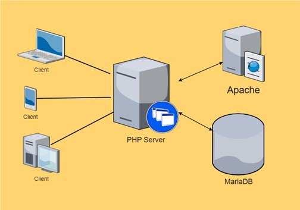
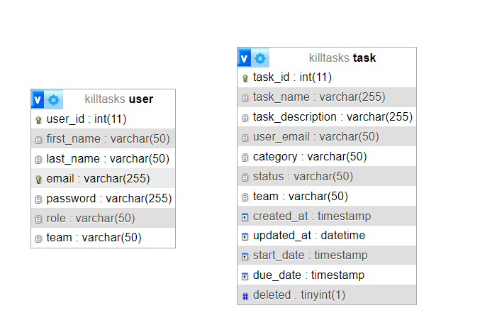

# Kill Tasks: Help You Get Ahead

## Introduction

In modern society, we are often expected to be multi-tasking but in reality, just like a computer a CPU, we are only context-switching between each other, to keep ourselves on track.
Task management is a handy tool for personal use or groups to keep track of the status of different tasks, the status, and who handles each task.

## Goal

Our task management is to have a clear view of all the tasks, here is the list of functionalities the task management should be able to perform.
1.Show all tasks
2.Categorizing by status or group
3.A dashboard to oversee status and tasks to show the overall performance.
4.The task list can be sorted.
5.Description, title, or responsible personnel can search for tasks.
6.User accounts can be created and deleted.
7.Support user authentication
8.Creating, Retrieve, Update, Delete tasks.

The main goal of our task management is to give the user a quick, clean and clear view of the breakdowns of all the current tasks, so he/she will be on track with all ongoing responsibilities, and hopefully get ahead of the rest.
We believe the first stage of this application will have 4 main pages, a login page, the dashboard, a personal task page, and an account settings page.

### Dashboard

The dashboard with a table to show all tasks, statuses, and categories, we will also include a chart of who has the most responsibilities, as well as the ratio of tasks that have been completed, working, and delayed, the user can also update his/her task, and upcoming incomplete tasks.

### Personal

The personal task page will allow the user to view the details of his/her task, and able to view the history of completed tasks.

## Non-Goal

The task management system is not meant to include a calendar, Gantt chart, or Kanban board, it also does not support email inbox, real-time messaging, and not supporting hierarchical roles.

## Design Detail

### Architecture

The application will be using PHP, MariaDB, and Apache as the server-side technology stack. The pages will be dynamically loaded and updated with PHP, JavaScript, HTML5 and CSS3. The application will be server-side rendered to provide a monolithic application approach.

### Database Design

Conceptual
User – first_name, last_name, email, password, role, team, created_at
Task – task_name, task_description, status, user, team, created_at, updated_at, start_date, due_date	

### Physical Design

### Frontend Technology Stack

For KillTasks, the frontend technology stack will be HTML5, CSS3, JavaScript (ES2022), Bootstrap, ChartJS.

## Summary

The task management application is a lightweight task management for personal and small groups to use, the user can CRUD tasks,  and able to have an overview of the overall status of all tasks, and performance.
